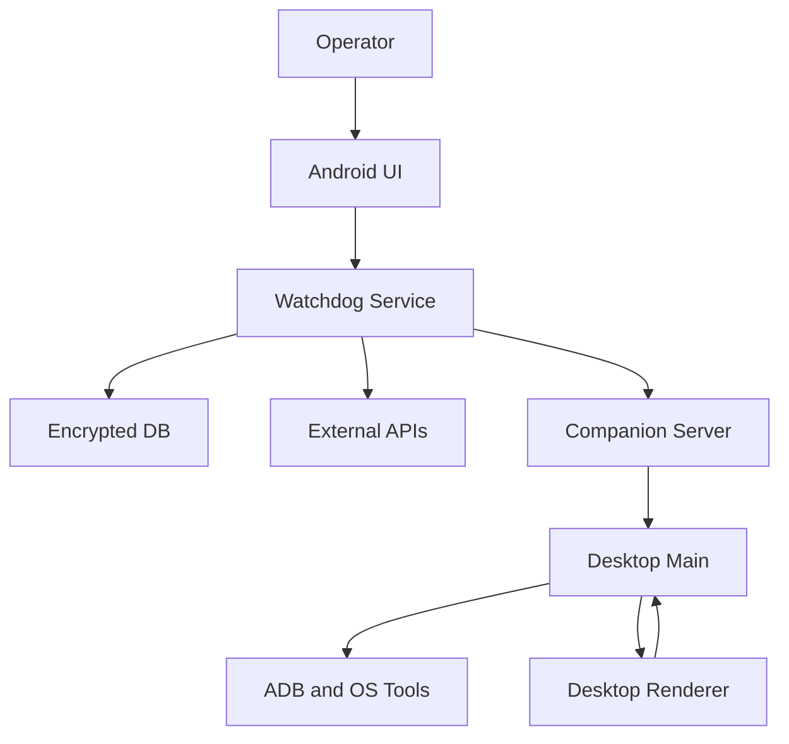

# Threat Model: wscanplus

## Executive summary

The top risk themes are local trust-boundary confusion, integrity of device-to-desktop telemetry, and protection of GPS-tagged scan history. The highest-risk areas are the Android encrypted database lifecycle, the desktop companion ingest path, and the optional outbound enrichment paths (CrowdSec CTI, Gemini) because they sit at boundaries where local-only assumptions can quietly break. Evidence anchors: `android/app/src/main/kotlin/com/wscanplus/app/WatchdogService.kt`, `android/app/src/main/kotlin/com/wscanplus/app/ScanMapActivity.kt`, `desktop/companionServer.mjs`, `desktop/main.js`.

## Scope and assumptions

- In scope:
  - `android/app/src/main/kotlin/com/wscanplus/app/`
  - `android/core/src/main/kotlin/com/wscanplus/core/`
  - `desktop/`
- Out of scope:
  - GitHub automation details except where they influence runtime dependency integrity
  - test-only code except as evidence of intended behavior
  - archived sibling repos except where current docs or migration history reference them
- Explicit assumptions:
  - The product is primarily a single-operator local tool, not a multi-tenant hosted service.
  - Users may expose the desktop companion path more broadly than intended, so LAN misuse must be treated as plausible even if not the default.
  - GPS-tagged scan history is both operationally important and confidentiality-sensitive.
  - Android cloud integrations are optional enrichment; local scanning remains the core function.
  - Desktop companion and ADB paths are expected to run on trusted hosts, but the repo does not fully enforce that operational assumption.
- Open questions that would materially change ranking:
  - Whether the desktop companion server will ever be documented or supported for hostile-LAN exposure.
  - Whether exported JSON artifacts are expected to be shared outside the device owner’s immediate control.

## System model

### Primary components

- Android foreground scanner service: `WatchdogService` orchestrates Wi-Fi scanning, persists scan sessions/results/signals, samples location, and triggers optional CTI/Gemini/Kismet flows. Evidence: `android/app/src/main/kotlin/com/wscanplus/app/WatchdogService.kt`.
- Android local data layer: `WscanDatabase` stores scan sessions, results, threat signals, CTI cache, and Gemini narratives; SQLCipher is intended to protect it at rest. Evidence: `android/core/src/main/kotlin/com/wscanplus/core/db/WscanDatabase.kt`, `android/app/src/main/kotlin/com/wscanplus/app/db/DbPassphraseProvider.kt`.
- Android operator UI: `MainActivity`, `ThreatResultsActivity`, `ScanHistoryActivity`, and `ScanMapActivity` expose runtime state and exports to the operator. Evidence: `android/app/src/main/kotlin/com/wscanplus/app/MainActivity.kt`, `android/app/src/main/kotlin/com/wscanplus/app/ThreatResultsActivity.kt`, `android/app/src/main/kotlin/com/wscanplus/app/ScanHistoryActivity.kt`, `android/app/src/main/kotlin/com/wscanplus/app/ScanMapActivity.kt`.
- Desktop Electron app: `main.js` owns Electron window lifecycle, local IPC, ADB transport startup, scan orchestration, and companion server startup. Evidence: `desktop/main.js`, `desktop/preload.js`.
- Desktop companion ingest: `CompanionServer` accepts authenticated WebSocket scan payloads and feeds them into desktop state. Evidence: `desktop/companionServer.mjs`.
- Desktop scan/runtime layer: `scanner.mjs`, `store.mjs`, and `detector.mjs` execute local `iw` scans, maintain desktop AP/risk state, and push updates to the renderer. Evidence: `desktop/scanner.mjs`, `desktop/store.mjs`, `desktop/detector.mjs`.
- External providers:
  - CrowdSec CTI over HTTPS. Evidence: `android/app/src/main/kotlin/com/wscanplus/app/cti/CrowdSecCtiClient.kt`.
  - Firebase AI Gemini over SDK-managed network transport. Evidence: `android/app/src/main/kotlin/com/wscanplus/app/gemini/GeminiThreatAnalyzer.kt`.
  - Local offline heatmap rendering. Evidence: `android/app/src/main/kotlin/com/wscanplus/app/ScanMapActivity.kt`, `android/app/src/main/kotlin/com/wscanplus/app/LocalHeatmapView.kt`.
  - Kismet GPS upload path. Evidence: `android/app/src/main/kotlin/com/wscanplus/app/kismet/KismetGpsClient.kt`.

### Data flows and trust boundaries

- Operator -> Android app UI
  - Data types: permissions, consent choice, UI actions, export triggers.
  - Channel/protocol: Android activity/service IPC and in-process calls.
  - Security guarantees: Android app sandbox, permission model, explicit activity launches.
  - Validation/normalization: permission checks in `MainActivity`, consent gate in `ConsentStore`.
  - Evidence: `android/app/src/main/kotlin/com/wscanplus/app/MainActivity.kt`, `android/app/src/main/kotlin/com/wscanplus/app/privacy/ConsentStore.kt`.
- Android scanner -> Android local DB
  - Data types: BSSIDs, SSIDs, GPS coordinates, threat signals, device identifiers, Gemini narratives, CTI cache entries.
  - Channel/protocol: in-process Room/SQLite access.
  - Security guarantees: intended SQLCipher at-rest encryption via `SupportFactory`; no app-layer row authZ because single-user model.
  - Validation/normalization: threat signals derived from typed scanner results; DB schema and Room models constrain structure.
  - Evidence: `android/app/src/main/kotlin/com/wscanplus/app/WatchdogService.kt`, `android/core/src/main/kotlin/com/wscanplus/core/db/WscanDatabase.kt`.
- Android app -> External CTI / AI / Kismet providers
  - Data types: IP reputation queries, threat summaries/prompts, GPS data.
  - Channel/protocol: HTTPS via OkHttp / Firebase SDK / Kismet HTTP config.
  - Security guarantees: consent checks for CTI/Gemini/Kismet, TLS through SDK/client stacks, local secret injection via gradle/secrets files.
  - Validation/normalization: consent checks and placeholder-key guards exist; quota and response validation are partial.
  - Evidence: `android/app/src/main/kotlin/com/wscanplus/app/cti/CrowdSecCtiClient.kt`, `android/app/src/main/kotlin/com/wscanplus/app/gemini/GeminiThreatAnalyzer.kt`, `android/app/src/main/kotlin/com/wscanplus/app/kismet/KismetGpsClient.kt`, `android/app/build.gradle.kts`.
- Desktop renderer -> Electron main
  - Data types: scan control requests, session import requests, companion token requests, ADB preflight requests.
  - Channel/protocol: Electron IPC `ipcRenderer.invoke` / `ipcMain.handle`.
  - Security guarantees: `contextIsolation: true`, preload bridge, denied window-open/navigation.
  - Validation/normalization: bridge narrows available calls; some input validation exists, but IPC surface is largely trusted renderer-to-main.
  - Evidence: `desktop/preload.js`, `desktop/main.js`.
- Desktop main -> OS tools / ADB
  - Data types: interface names, device selectors, ADB commands, `iw` scan output.
  - Channel/protocol: local subprocess execution via `spawn`, ADB TCP client library.
  - Security guarantees: `spawn` avoids shell interpolation; device selector validation exists for some ADB paths.
  - Validation/normalization: `validateDeviceSelector` guards `adb -s`; interface values are less constrained.
  - Evidence: `desktop/main.js`, `desktop/scanner.mjs`, `desktop/adbPreflight.mjs`, `desktop/adb/AdbTransport.js`.
- Android companion or local network peer -> Desktop companion server
  - Data types: auth token, device IDs, sequence numbers, timestamps, network scan payloads.
  - Channel/protocol: WebSocket over local HTTP server.
  - Security guarantees: token-based auth, freshness checks, monotonic sequence checks, rate limiting, localhost default bind unless env overrides.
  - Validation/normalization: JSON parse, token check, timestamp freshness, integer sequence check, network array requirement.
  - Evidence: `desktop/companionServer.mjs`, `desktop/main.js`.

#### Diagram

## Assets and security objectives

| Asset | Why it matters | Security objective (C/I/A) |
|---|---|---|
| GPS-tagged scan history | Reveals operator location, movement, and target environment patterns | C, I |
| Threat signals and Gemini narratives | Drives operator decisions and incident interpretation | I, A |
| Companion auth token and sequence state | Protects desktop ingest from spoofed or replayed device data | C, I |
| Android encrypted database key material | Protects all persisted scan and location data at rest | C, I |
| Desktop IPC and scan control surface | Can start scans, access artifacts, and influence local device interaction | I, A |
| CTI/Gemini/Kismet configuration and API keys | Governs external trust and paid/limited integrations | C, I |
| Exported JSON artifacts | Portable bundle of sensitive scan/session/narrative data | C, I |
| ADB and local scan execution path | Controls device attachment state and local OS-level scan operations | I, A |

## Attacker model

### Capabilities

- A local attacker on the same host or with access to the operator session can interact with the Android UI, desktop renderer, exported files, and possibly local config/secrets.
- A nearby or LAN-adjacent attacker may be able to reach the desktop companion server if the operator binds it beyond localhost or exposes it via environment settings.
- A malicious Android-side peer or replay client can attempt to send malformed or replayed companion payloads to desktop.
- An attacker controlling scanned wireless environments can influence SSIDs/BSSIDs/RSSI-derived analysis and downstream narratives.
- A network attacker between the app and optional cloud APIs is constrained by TLS, but misuse of data sent to those providers remains in scope.

### Non-capabilities

- No evidence suggests a public multi-tenant backend or remote administrative API that allows classic internet pre-auth attacks against a hosted service.
- There is no evidence of user-to-user authorization boundaries inside the app; cross-tenant or cross-account threats are out of scope.
- There is no obvious dynamic code evaluation path in production runtime code from arbitrary remote input.

## Entry points and attack surfaces

| Surface | How reached | Trust boundary | Notes | Evidence (repo path / symbol) |
|---|---|---|---|---|
| Android permission/consent onboarding | Operator launches app and responds to dialogs | Operator -> Android UI | Governs scanner start and cloud-sharing posture | `android/app/src/main/kotlin/com/wscanplus/app/MainActivity.kt` / `showConsentDialog` |
| Android foreground service start | `MainActivity` starts `WatchdogService` | UI -> Service | Central runtime orchestrator | `android/app/src/main/kotlin/com/wscanplus/app/MainActivity.kt` / `startWatchdog` |
| Android DB open path | Activities/service call `WscanDatabase.getInstance` | App logic -> local DB | Mixed encrypted/non-encrypted call sites exist | `android/core/src/main/kotlin/com/wscanplus/core/db/WscanDatabase.kt` / `getInstance` |
| Scan map screen | Operator opens map activity | UI -> encrypted DB / local heatmap view | DB passphrase bootstrap must remain consistent | `android/app/src/main/kotlin/com/wscanplus/app/ScanMapActivity.kt` / `renderHeatmap` |
| JSON export | Operator taps export in results UI | UI -> DB -> filesystem/share sheet | Creates portable artifact containing sensitive data | `android/app/src/main/kotlin/com/wscanplus/app/ThreatResultsActivity.kt` / `exportJson`, `android/app/src/main/kotlin/com/wscanplus/app/export/ScanDataExporter.kt` |
| CrowdSec CTI lookup | Internal runtime call from service logic | App -> external HTTPS | Consent-gated but quota semantics are partial | `android/app/src/main/kotlin/com/wscanplus/app/cti/CrowdSecCtiClient.kt` / `lookupSmoke`, `android/app/src/main/kotlin/com/wscanplus/app/cti/CtiCacheRepository.kt` |
| Gemini narrative generation | Internal runtime call from service logic | App -> external SDK service | Consent-gated cloud prompt flow | `android/app/src/main/kotlin/com/wscanplus/app/gemini/GeminiThreatAnalyzer.kt` / `analyze` |
| Desktop IPC bridge | Desktop renderer invokes preload API | Renderer -> Electron main | Narrow bridge exists but main process still owns sensitive operations | `desktop/preload.js`, `desktop/main.js` |
| Desktop companion server | WebSocket client connects and authenticates | Network peer -> Desktop main | Token auth + replay/rate controls; local bind default can be overridden | `desktop/companionServer.mjs` / `start`, `#handleConnection` |
| Desktop local scan path | Renderer starts scan or main starts scan loop | Desktop main -> OS tools | Uses `iw` and local interface names | `desktop/scanner.mjs` / `runCommand`, `startScanning` |
| Desktop ADB preflight and transport | Renderer triggers ADB actions | Desktop main -> local ADB / attached device | Some selector validation present | `desktop/main.js` / `runAdb`, `android/adb/AdbTransport.js` |

## Top abuse paths

1. Attacker goal: read or corrupt local Android telemetry despite “encrypted DB” expectations.
   1. Operator opens the scan map before other DB-backed views.
   2. `ScanMapActivity` instantiates the Room singleton without `SupportFactory`.
   3. Later encrypted callers reuse the cached singleton anyway.
   4. Result: DB protection assumptions are weakened or become inconsistent across the process.

2. Attacker goal: inject or suppress desktop companion telemetry.
   1. Operator exposes the companion server beyond localhost or uses a reachable LAN bind.
   2. Attacker attempts auth guessing, replay, or crafted scan payload submission.
   3. Token auth and replay controls reduce risk, but token theft or operational misuse still enables forged scan events.
   4. Result: desktop state and operator conclusions can be manipulated.

3. Attacker goal: permanently disrupt a legitimate companion after routine re-pairing.
   1. Legitimate device pairs once and increments sequence state.
   2. Operator rotates token or restarts pairing workflow.
   3. Device reconnects with sequence reset.
   4. Desktop monotonic-sequence logic rejects all subsequent payloads.
   5. Result: persistent availability failure in companion ingest.

4. Attacker goal: cause excessive CTI requests despite local quota controls.
   1. App repeatedly attempts CTI lookups during failures or non-success responses.
   2. Local quota tracker records only successful responses.
   3. Outbound requests still consume remote-side quota or abuse allowance.
   4. Result: operator loses enrichment availability and local controls misreport remaining budget.

5. Attacker goal: exfiltrate sensitive operator history via portable exports.
   1. Local actor with device access triggers JSON export or obtains exported cache files.
   2. Artifact contains session data, BSSIDs, threat signals, narratives, and device-linked metadata.
   3. File is shared off-device through Android chooser or copied from cache.
   4. Result: confidentiality loss of scan history and operational context.

6. Attacker goal: influence threat conclusions through hostile wireless environment manipulation.
   1. Nearby attacker broadcasts crafted SSIDs/BSSIDs/RSSI patterns.
   2. Android and desktop heuristic engines ingest the observations as real scan inputs.
   3. Threat scoring and Gemini narrative generation amplify the manipulated signal.
   4. Result: operator sees misleading threat signals or noisy false positives.

7. Attacker goal: abuse desktop local privileged actions through a compromised renderer context.
   1. Renderer logic is compromised by local file tampering, malicious artifact ingestion side effects, or future UI regression.
   2. Preload-exposed IPC functions trigger ADB actions, file import, scan start/stop, and companion token generation.
   3. Main process executes the requested actions with local privileges.
   4. Result: integrity and availability impact on desktop operations and attached devices.

## Threat model table

| Threat ID | Threat source | Prerequisites | Threat action | Impact | Impacted assets | Existing controls (evidence) | Gaps | Recommended mitigations | Detection ideas | Likelihood | Impact severity | Priority |
|---|---|---|---|---|---|---|---|---|---|---|---|---|
| TM-001 | Local operator-path misuse or local attacker | `ScanMapActivity` is opened before encrypted DB callers in the same process | Open Room singleton without SQLCipher factory and poison later DB access | Weakens or breaks at-rest protection assumptions for runtime data | GPS-tagged scan history, narratives, CTI cache, device identifiers | Encrypted DB intent exists via `DbPassphraseProvider` and `SupportFactory` in `WatchdogService`, `ThreatResultsActivity`, `ScanHistoryActivity`, `ScanDataExporter` | `ScanMapActivity` bypasses that contract; singleton ignores later factories | Require a single encrypted DB bootstrap helper and forbid null factory in production callers; add a runtime assertion if instance exists without SQLCipher | Log DB helper mode at first open; crash/report if production instance is created without `SupportFactory` | Medium | High | high |
| TM-002 | LAN-adjacent attacker or unintended operator exposure | Desktop server is bound beyond localhost or host is reachable on a shared LAN | Connect to companion server and attempt forged or replayed scan submissions | Corrupts desktop AP/risk state and operator decisions | Companion token, desktop telemetry integrity, operator trust | Token auth, timestamp freshness, monotonic sequence, rate limit, localhost default bind (`desktop/companionServer.mjs`) | No mutual auth, no origin binding, unclear operator guardrails if host is exposed | Keep localhost-only default, add prominent UI warning when host != `127.0.0.1`, consider per-device binding or one-time token invalidation after first use | Log remote address, auth failures, rate-limit hits, and token-generation events | Medium | High | high |
| TM-003 | Legitimate peer / reliability abuse | Device previously paired and sequence state exists | Re-pair or restart with reset sequence and get permanently rejected | Companion ingest availability failure | Companion server availability, desktop telemetry continuity | Sequence monotonicity and rate limit exist | Session state survives token rotation and stop/start | Clear per-device sequence state on token rotation or server restart; bind sequence state to token epoch | Log rejected payload reason and device ID; alert on repeated monotonicity rejects after token generation | High | Medium | high |
| TM-004 | Remote service behavior / local logic gap | CTI lookup path is invoked during failures or non-success HTTP responses | Send repeated outbound CTI requests without incrementing local quota | Burns remote quota and undermines safety control accuracy | CTI availability, operator trust in quota guardrail | Consent gate, placeholder-key block, local cache, quota tracker | Quota records only successful results, not all attempts | Record attempted outbound calls before dispatch or on any HTTP transaction start; align tests and policy docs | Count CTI attempts, responses, and quota state transitions; alert on repeated failures near limit | Medium | Medium | medium |
| TM-005 | Local attacker with device/session access | Operator or attacker can trigger export/share | Export scan sessions and narratives to portable JSON | Confidentiality loss of location-linked evidence and narratives | Export artifacts, GPS-tagged history, threat narratives | Export is user-triggered and constrained to app cache + `FileProvider` | No secondary confirmation, sensitivity labeling, or artifact expiry controls | Add explicit sensitivity warning, optional redaction mode, and cache cleanup after share; document handling expectations | Audit export creation events and file counts; optionally expire old exports on app start | Medium | High | high |
| TM-006 | Nearby wireless attacker | Ability to broadcast hostile Wi-Fi environment signals | Craft SSIDs/BSSIDs/RSSI patterns to steer heuristics and narratives | False positives, misprioritized incidents, analyst confusion | Threat signals, Gemini narratives, operator workflow | Local heuristics, policy gate, baseline logic, no direct code execution path | Limited anti-spoof context; stale baseline/state issues can amplify noise | Add stronger baseline aging, confidence dampening, and explicit provenance in UI; separate observed facts from inferred narrative | Monitor bursty signal patterns, repeated collision events, and high-confidence narratives on sparse evidence | High | Medium | medium |
| TM-007 | Local renderer compromise | Renderer context is compromised locally or through a future UI regression | Abuse preload-exposed IPC to trigger scans, ADB actions, or artifact imports | Integrity/availability impact on desktop runtime and attached devices | Desktop IPC surface, ADB path, scan loop | `contextIsolation: true`, denied navigation/window-open, narrow preload bridge (`desktop/main.js`, `desktop/preload.js`) | Main process still trusts renderer-originated values for many actions; limited argument validation | Validate IPC arguments centrally, reduce bridge surface, add allowlists for interface names and file actions | Log IPC action requests and abnormal call frequency; test malformed IPC inputs | Low | High | medium |

## Criticality calibration

- `critical`
  - Anything that enables broad compromise of persisted operator data despite the intended encrypted-storage model.
  - Anything that gives an untrusted remote party reliable control over desktop ingest or attached-device actions without operator mediation.
  - Example class for this repo: a confirmed bypass letting hostile-LAN clients drive companion ingestion without a valid token.
- `high`
  - Confidentiality loss of GPS-tagged scans, narratives, or device-linked history.
  - Integrity compromise of operator-visible threat conclusions or durable telemetry.
  - Availability failures that break a core workflow such as Android scan persistence or desktop companion ingestion.
- `medium`
  - Abuse that requires local access or unusual operator configuration but still causes meaningful data leakage or trust erosion.
  - Rate-limit bypass, misleading narratives from hostile wireless input, or degraded export handling.
  - Reliability/security boundary bugs that need realistic but non-default preconditions.
- `low`
  - Low-sensitivity leaks, noisy local-only issues, or bugs requiring improbable preconditions with limited asset impact.
  - Developer tooling concerns that do not materially affect runtime integrity or secrets handling.

## Focus paths for security review

| Path | Why it matters | Related Threat IDs |
|---|---|---|
| `android/app/src/main/kotlin/com/wscanplus/app/ScanMapActivity.kt` | Only known production DB call site bypassing SQLCipher factory | TM-001 |
| `android/core/src/main/kotlin/com/wscanplus/core/db/WscanDatabase.kt` | Singleton/open-helper behavior controls whether encrypted DB assumptions actually hold | TM-001 |
| `android/app/src/main/kotlin/com/wscanplus/app/db/DbPassphraseProvider.kt` | Key creation, fail-closed behavior, and plaintext migration logic protect persisted data | TM-001 |
| `android/app/src/main/kotlin/com/wscanplus/app/WatchdogService.kt` | Central runtime orchestrator for scanner, DB writes, CTI, Gemini, and Kismet | TM-001, TM-004, TM-006 |
| `android/app/src/main/kotlin/com/wscanplus/app/cti/CtiCacheRepository.kt` | Quota semantics and cache fallback policy live here | TM-004 |
| `android/app/src/main/kotlin/com/wscanplus/app/cti/CrowdSecCtiClient.kt` | Outbound request path and remote failure handling | TM-004 |
| `android/app/src/main/kotlin/com/wscanplus/app/export/ScanDataExporter.kt` | Produces portable artifact containing sensitive local intelligence | TM-005 |
| `android/app/src/main/kotlin/com/wscanplus/app/ThreatResultsActivity.kt` | Export UX and DB-backed narrative display path | TM-005 |
| `desktop/companionServer.mjs` | Auth, replay, rate limiting, and sequence-state integrity for desktop ingest | TM-002, TM-003 |
| `desktop/main.js` | Electron lifecycle, IPC control plane, server startup, and ADB orchestration | TM-002, TM-003, TM-007 |
| `desktop/preload.js` | Security boundary between renderer and privileged main process | TM-007 |
| `desktop/scanner.mjs` | Local subprocess execution and scan-loop control | TM-007 |

## Quality check

- Entry points covered:
  - Android UI/service start, DB callers, export path, CTI/Gemini/Kismet, desktop IPC, desktop companion server, local scan/ADB paths.
- Trust boundaries represented in threats:
  - operator -> app, app -> DB, app -> cloud providers, renderer -> main, network peer -> companion server, main -> OS tools.
- Runtime vs CI/dev separation:
  - runtime is primary scope; CI/build only used as supporting dependency-integrity context.
- User clarifications reflected:
  - desktop exposure treated as potentially broader than intended, deployment modeled as optional single-user, GPS history treated as both sensitive local data and operational evidence.
- Assumptions and open questions explicit:
  - included in the scope/assumptions section and used in priority calibration.
