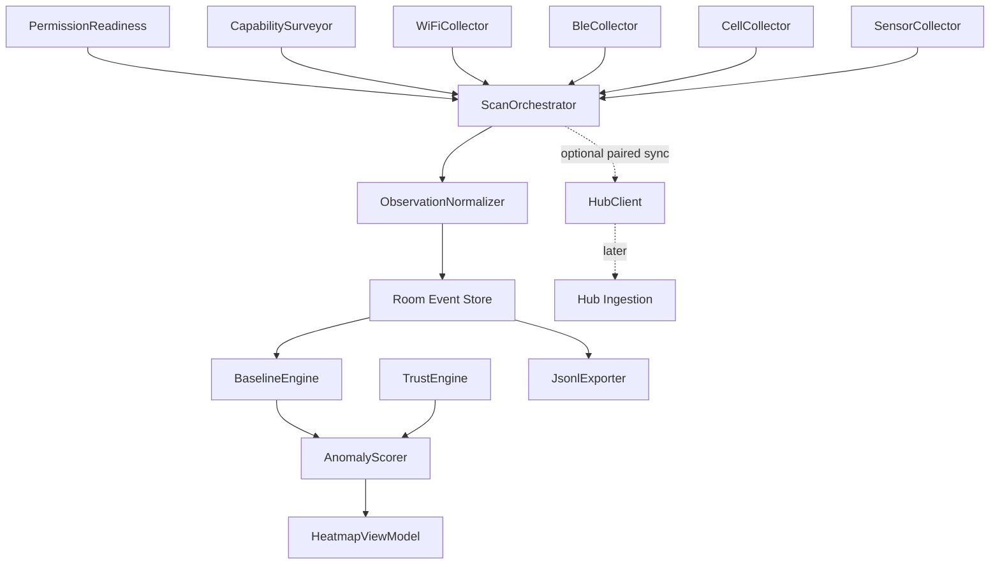

# Android Spatial Baseline Implementation Plan

Status: implementation handoff draft / code-review proposal  
Owner: dvntone  
Related: #234

This document establishes the Android-first implementation path for the spatial baseline detection MVP. It intentionally keeps Desktop/Linux Hub work secondary until the Android local baseline engine is useful, testable, and exportable.

## Source-of-truth decision

The active implementation path is:

```text
Android-first local spatial baseline detection MVP
    first

Optional Desktop/Linux Hub
    later / AC-release dependent
```

The Android app must work without Desktop Hub, SIM, internet, Google Maps, Gemini, or live cloud services. Maps, Gemini, and the desktop hub are value-add layers; they must not be required for core collection, local baseline comparison, local visualization, or evidence export.

## Product framing

wscan+ is a multi-sensor situational awareness and environmental anomaly platform. It compares future observations against a learned local baseline and reports likely anomaly regions, confidence changes, observed RF/environmental changes, missing or appearing signals, corroborating evidence, and scan/export history.

The app must not claim exact hidden-device location, guaranteed hidden-camera detection, through-wall detection, direct Stingray/IMSI-catcher detection on stock Android, centimeter-level indoor positioning, or definitive maliciousness without corroboration.

Preferred language:

```text
Likely anomaly region
Observed baseline change
Confidence increased
New signal observed in this area
Known AP missing repeatedly
Signal behavior differs from this location's baseline
Scan data appears stale
Needs more samples
```

Avoid:

```text
Hacker nearby
Spy device found
Stingray detected
Hidden camera found
Device is behind this wall
This AP is malicious
```

## Platform constraints

### Wi-Fi

Implementation rules:

- `startScan()` can fail.
- `startScan()` can be throttled.
- `getScanResults()` can return older results if a fresh scan did not complete.
- Location Services must be enabled for scan results on modern Android.
- Every Wi-Fi observation must carry freshness state.
- Stale/no data must never be interpreted as safe.

For wscan+:

- Keep `ACCESS_FINE_LOCATION`.
- Keep `ACCESS_WIFI_STATE`.
- Keep `CHANGE_WIFI_STATE`.
- Use `NEARBY_WIFI_DEVICES` for Android 13+ where needed.
- Do not use `neverForLocation` for Wi-Fi because scan data contributes to spatial baseline mapping.
- Surface permission denial as a readiness blocker.

### BLE

For Android 12+:

- `BLUETOOTH_SCAN` is required to scan.
- `BLUETOOTH_CONNECT` is required when accessing paired-device/connection metadata.
- `BLUETOOTH_ADVERTISE` is only needed if the app advertises.

For Android 11 and lower, BLE scanning requires location permission because scan results can imply physical location.

For wscan+:

- Do not use `neverForLocation` on `BLUETOOTH_SCAN`; spatial correlation is part of the product.
- Treat BLE address as volatile.
- Use fingerprint evidence, not address alone.

### Foreground service

For Android 14+ target apps:

- Foreground services must declare appropriate service types.
- Type-specific foreground service permissions must be declared.
- Runtime prerequisites must be satisfied before `startForeground()`.
- Camera and microphone sweep modules require separate type/permission handling and must not be bundled into the baseline scan service by default.

Baseline scanning may require:

```xml
<uses-permission android:name="android.permission.FOREGROUND_SERVICE" />
<uses-permission android:name="android.permission.FOREGROUND_SERVICE_LOCATION" />
<uses-permission android:name="android.permission.FOREGROUND_SERVICE_CONNECTED_DEVICE" />
<uses-permission android:name="android.permission.ACCESS_FINE_LOCATION" />
```

## MVP requirements

Must have:

1. Android standalone mode:
   - runs without Desktop Hub, SIM, internet, Maps, or Gemini
   - collects Wi-Fi observations locally
   - collects BLE observations where hardware and permissions allow
   - collects cellular observations where OS and permissions allow
   - collects motion/orientation/barometer snapshots where sensors exist
   - creates local baseline sessions
   - compares later scans against local baselines
   - renders local 2.5D/grid heatmap
   - exports JSONL evidence
   - supports trust/benign marking
2. Permission and capability readiness:
   - models supported, unsupported, disabled, permission-missing, stale, and battery-blocked states
   - explains why scans are unavailable or degraded
   - never silently treats missing data as safe
3. Reliable scan pipeline:
   - one orchestrated scan path
   - single-flight scan cycles
   - freshness tracking
   - structured failure/system events
   - handles `SecurityException`, disabled radios, null sensors, battery restrictions, and OEM quirks
4. Spatial baseline engine:
   - local grid cells
   - per-cell RSSI and observation statistics
   - later scan comparison
   - confidence-based anomaly events
5. Trust model:
   - user can mark APs, BLE fingerprints, vendors, cells, or anomaly types as trusted/benign
   - trust lowers confidence but does not delete raw evidence
   - trust is reviewable and optionally expiring
6. Evidence export:
   - JSONL
   - schema versioning
   - redaction controls
   - streaming export
   - export manifest with record count and optional SHA-256

Won't have in MVP:

- plugin system
- full AR renderer
- acoustic sonar
- Bayesian/ML classifier
- graph propagation
- Kismet live bridge
- offline map marketplace
- managed paid AI-key system
- exact hidden-device or direct Stingray claims

## Architecture



Recommended package layout:

```text
app/src/main/java/com/wscanplus/app/
  capabilities/
    CapabilityState.kt
    ReadinessBlocker.kt
    PermissionReadiness.kt
    PermissionReadinessProvider.kt
    DeviceCapabilityManifest.kt
    CapabilitySurveyor.kt
  collection/
    wifi/
      WifiCollector.kt
      WifiObservation.kt
      WifiObservationMapper.kt
      WifiScanFreshness.kt
      WifiScanReceiver.kt
      WifiIeFingerprint.kt
    ble/
      BleCollector.kt
      BleObservation.kt
      BleObservationMapper.kt
      BleFingerprint.kt
      BleStalenessTracker.kt
      BleOemShim.kt
    cell/
      CellCollector.kt
      CellObservation.kt
      CellObservationMapper.kt
    sensors/
      SensorCollector.kt
      SensorSnapshot.kt
      PoseEstimator.kt
  orchestrator/
    ScanOrchestrator.kt
    ScanCycleResult.kt
    CollectionSessionManager.kt
  spatial/
    GridCellKey.kt
    GridMapper.kt
    SpatialMap.kt
    Pose2_5D.kt
    RssiStats.kt
    BaselineEngine.kt
    BaselineRepository.kt
    BaselineDiff.kt
    AnomalyScorer.kt
    AnomalyEvent.kt
  trust/
    TrustEntry.kt
    TrustRepository.kt
    TrustEvaluator.kt
  export/
    JsonlExporter.kt
    EvidenceExportManifest.kt
    RedactionProfile.kt
    ExportEvent.kt
  hub/
    ObservationProtocol.kt
    PairingToken.kt
    HubClient.kt
  data/
    WscanDatabase.kt
    dao/
    entities/
  service/
    ScanForegroundService.kt
  ui/
    permissions/
    baseline/
    heatmap/
    export/
```

## Manifest baseline

```xml
<manifest xmlns:android="http://schemas.android.com/apk/res/android">
    <uses-permission android:name="android.permission.ACCESS_WIFI_STATE" />
    <uses-permission android:name="android.permission.CHANGE_WIFI_STATE" />
    <uses-permission android:name="android.permission.ACCESS_FINE_LOCATION" />
    <uses-permission android:name="android.permission.NEARBY_WIFI_DEVICES" />
    <uses-permission android:name="android.permission.BLUETOOTH_SCAN" />
    <uses-permission android:name="android.permission.BLUETOOTH_CONNECT" />
    <uses-permission android:name="android.permission.BLUETOOTH" android:maxSdkVersion="30" />
    <uses-permission android:name="android.permission.BLUETOOTH_ADMIN" android:maxSdkVersion="30" />
    <uses-permission android:name="android.permission.FOREGROUND_SERVICE" />
    <uses-permission android:name="android.permission.FOREGROUND_SERVICE_LOCATION" />
    <uses-permission android:name="android.permission.FOREGROUND_SERVICE_CONNECTED_DEVICE" />

    <uses-feature android:name="android.hardware.wifi" android:required="false" />
    <uses-feature android:name="android.hardware.bluetooth_le" android:required="false" />
    <uses-feature android:name="android.hardware.sensor.barometer" android:required="false" />
    <uses-feature android:name="android.hardware.sensor.compass" android:required="false" />
    <uses-feature android:name="android.hardware.sensor.gyroscope" android:required="false" />

    <application>
        <service
            android:name=".service.ScanForegroundService"
            android:exported="false"
            android:foregroundServiceType="location|connectedDevice" />
    </application>
</manifest>
```

Do not enable camera/microphone permissions in the baseline MVP. They are later modules with separate foreground-service and privacy requirements.

## Runtime capability model

```kotlin
package com.wscanplus.app.capabilities

enum class CapabilityState {
    SUPPORTED_AND_READY,
    SUPPORTED_PERMISSION_MISSING,
    SUPPORTED_DISABLED_BY_SYSTEM,
    SUPPORTED_BLOCKED_BY_BATTERY,
    SUPPORTED_BUT_STALE,
    UNSUPPORTED_BY_HARDWARE,
    UNSUPPORTED_BY_OS,
    UNKNOWN_UNTESTED
}

enum class ReadinessBlocker {
    MISSING_WIFI_PERMISSION,
    MISSING_CHANGE_WIFI_STATE,
    MISSING_ACCESS_WIFI_STATE,
    MISSING_FINE_LOCATION,
    MISSING_NEARBY_WIFI_DEVICES,
    LOCATION_SERVICES_DISABLED,
    MISSING_BLE_SCAN_PERMISSION,
    MISSING_BLE_CONNECT_PERMISSION,
    BLUETOOTH_DISABLED,
    CELL_PERMISSION_MISSING,
    BACKGROUND_LOCATION_MISSING,
    BACKGROUND_RESTRICTED,
    BATTERY_OPTIMIZATION_ACTIVE,
    FOREGROUND_SERVICE_NOT_RUNNING,
    SCAN_THROTTLED,
    SCAN_RESULTS_STALE,
    DEVICE_OEM_QUIRK_ACTIVE,
    SENSOR_UNAVAILABLE,
    UNKNOWN
}

data class PermissionReadiness(
    val wifi: CapabilityState,
    val ble: CapabilityState,
    val cellular: CapabilityState,
    val sensors: CapabilityState,
    val blockers: Set<ReadinessBlocker>,
    val checkedAtMs: Long = System.currentTimeMillis()
) {
    val canRunMinimumScan: Boolean
        get() = wifi == CapabilityState.SUPPORTED_AND_READY &&
            !blockers.contains(ReadinessBlocker.LOCATION_SERVICES_DISABLED)

    val degraded: Boolean
        get() = blockers.isNotEmpty() ||
            ble != CapabilityState.SUPPORTED_AND_READY ||
            cellular != CapabilityState.SUPPORTED_AND_READY ||
            sensors != CapabilityState.SUPPORTED_AND_READY
}

interface PermissionReadinessProvider {
    fun current(): PermissionReadiness
}
```

Device capability manifest must include hardware support and runtime state. Hardware capability is not the same as usable runtime capability.

## Foreground service pattern

```kotlin
class ScanForegroundService : Service() {
    private val serviceScope = CoroutineScope(SupervisorJob() + Dispatchers.IO)
    private val scanMutex = Mutex()
    private lateinit var orchestrator: ScanOrchestrator

    override fun onCreate() {
        super.onCreate()
        orchestrator = ServiceLocator.provideScanOrchestrator(applicationContext)

        if (Build.VERSION.SDK_INT >= 34) {
            ServiceCompat.startForeground(
                this,
                NOTIFICATION_ID,
                buildNotification(),
                ServiceInfo.FOREGROUND_SERVICE_TYPE_LOCATION or
                    ServiceInfo.FOREGROUND_SERVICE_TYPE_CONNECTED_DEVICE
            )
        } else {
            startForeground(NOTIFICATION_ID, buildNotification())
        }

        serviceScope.launch {
            while (isActive) {
                scanMutex.withLock {
                    try {
                        orchestrator.runCycle()
                    } catch (se: SecurityException) {
                        orchestrator.reportPermissionFailure(se)
                    } catch (t: Throwable) {
                        orchestrator.reportCycleFailure(t)
                    }
                }
                delay(30_000L)
            }
        }
    }

    override fun onDestroy() {
        serviceScope.cancel()
        super.onDestroy()
    }

    override fun onBind(intent: Intent?): IBinder? = null

    companion object {
        private const val NOTIFICATION_ID = 1001
    }
}
```

Rules:

- Do not start camera/microphone modules inside this baseline service.
- Do not start the service before required runtime permissions are granted.
- Persist service failures as system events.
- Validate on Android 10, 11, 12, 13, 14+.

## Observation orchestration

```kotlin
data class ObservationBatch(
    val id: String,
    val sessionId: String,
    val capturedAtMs: Long,
    val readiness: PermissionReadiness,
    val wifi: List<WifiObservation>,
    val ble: List<BleObservation>,
    val cells: List<CellObservation>,
    val sensorSnapshot: SensorSnapshot?
)

data class ScanCycleResult(
    val capturedAtMs: Long,
    val readiness: PermissionReadiness,
    val wifiCount: Int,
    val bleCount: Int,
    val cellCount: Int,
    val anomalyCount: Int,
    val degraded: Boolean
)

class ScanOrchestrator(
    private val sessionIdProvider: () -> String,
    private val readiness: PermissionReadinessProvider,
    private val wifiCollector: WifiCollector,
    private val bleCollector: BleCollector,
    private val cellCollector: CellCollector,
    private val sensorCollector: SensorCollector,
    private val observationRepository: ObservationRepository,
    private val baselineEngine: BaselineEngine,
    private val anomalyScorer: AnomalyScorer,
    private val trustEvaluator: TrustEvaluator
) {
    private val mutex = Mutex()

    suspend fun runCycle(): ScanCycleResult = mutex.withLock {
        val state = readiness.current()
        val now = System.currentTimeMillis()
        val sensors = sensorCollector.snapshotOrNull(now)

        val wifi = if (state.wifi == CapabilityState.SUPPORTED_AND_READY) wifiCollector.collect(now) else emptyList()
        val ble = if (state.ble == CapabilityState.SUPPORTED_AND_READY) bleCollector.collect(now) else emptyList()
        val cells = if (state.cellular == CapabilityState.SUPPORTED_AND_READY) cellCollector.collect(now) else emptyList()

        val batch = ObservationBatch(
            id = UUID.randomUUID().toString(),
            sessionId = sessionIdProvider(),
            capturedAtMs = now,
            readiness = state,
            wifi = wifi,
            ble = ble,
            cells = cells,
            sensorSnapshot = sensors
        )

        observationRepository.insertBatch(batch)
        val diffs = baselineEngine.compare(batch)
        val adjusted = anomalyScorer.score(diffs).map { trustEvaluator.applyTrust(it) }
        observationRepository.insertAnomalies(adjusted)

        ScanCycleResult(now, state, wifi.size, ble.size, cells.size, adjusted.count { it.confidence >= 0.5 }, state.degraded)
    }
}
```

## Wi-Fi collection and freshness

```kotlin
data class WifiObservation(
    val id: String,
    val bssid: String,
    val ssid: String?,
    val rssiDbm: Int,
    val frequencyMhz: Int?,
    val channelWidthMhz: Int?,
    val centerFreq0Mhz: Int?,
    val centerFreq1Mhz: Int?,
    val capabilities: String?,
    val securityTypes: List<Int>,
    val wifiStandard: Int?,
    val informationElementHash: String?,
    val vendorOuiList: List<String>,
    val mloMacAddress: String?,
    val mloLinkId: Int?,
    val rttResponder: Boolean?,
    val observedAtMs: Long,
    val scanTimestampUs: Long?,
    val scanFreshness: ScanFreshness
)

enum class ScanFreshness {
    FRESH,
    STALE_PREVIOUS_RESULTS,
    SCAN_FAILED,
    SCAN_THROTTLED_OR_BLOCKED,
    UNKNOWN
}
```

Important rule:

```text
Active scan request and result consumption must be separated.

WifiCollector.collect() may perform an opportunistic read, but fresh scan attribution must come from the SCAN_RESULTS_AVAILABLE_ACTION broadcast path.
```

Implementation notes:

- Use `WifiManager.SCAN_RESULTS_AVAILABLE_ACTION`.
- Record `EXTRA_RESULTS_UPDATED`.
- Track newest `ScanResult.timestamp`.
- Classify old timestamps as stale.
- Persist scan failure/staleness as system events and readiness blockers.
- Do not treat stale/no scan results as safe.

## BLE observation model

```kotlin
data class BleObservation(
    val id: String,
    val address: String?,
    val addressType: String?,
    val name: String?,
    val rssiDbm: Int,
    val serviceUuids: List<String>,
    val manufacturerDataHash: String?,
    val serviceDataHash: String?,
    val rawAdvertisementHash: String?,
    val txPower: Int?,
    val connectable: Boolean?,
    val observedAtMs: Long,
    val scanFresh: Boolean
)

data class BleFingerprint(
    val stableServiceUuids: Set<String>,
    val manufacturerDataHash: String?,
    val serviceDataHash: String?,
    val rawAdvertisementHash: String?,
    val namePattern: String?,
    val addressRotationObserved: Boolean,
    val confidence: Double
)
```

Rules:

- BLE address is not durable identity.
- Use bounded recent-window buffering.
- Do not start/stop BLE scanning every scan cycle.
- Use balanced scan mode for long-running collection.
- Low-latency BLE scans should be short, explicit user actions.

## Cellular collection

Cellular should be framed as baseline anomaly, not Stingray detection.

Collect where available:

```text
CellInfoLte
CellInfoNr
CellInfoGsm/Wcdma
MCC/MNC/TAC/CI/PCI/NRARFCN/RSRP/RSRQ/SINR
```

Detect:

```text
unexpected tower combination
sudden signal dominance
unusual fallback from LTE/NR to GSM/UMTS
abrupt cell ID/TAC churn
location-baseline mismatch
```

Do not claim IMSI catcher detection.

## Pose and grid model

```kotlin
data class Vec3(val x: Float, val y: Float, val z: Float)

data class SensorSnapshot(
    val accelerometer: Vec3?,
    val gyroscope: Vec3?,
    val magnetometer: Vec3?,
    val pressureHPa: Float?,
    val stepCount: Long?,
    val deviceUptimeMs: Long,
    val wallClockMs: Long,
    val pose: Pose2_5D?
)

data class GridCellKey(val mapId: String, val floor: Int, val x: Int, val y: Int)

data class Pose2_5D(
    val mapId: String,
    val xMeters: Double,
    val yMeters: Double,
    val floor: Int,
    val headingDegrees: Double?,
    val confidence: Double
)
```

Rules:

- Pose is approximate.
- Barometer floor detection is a hint, not proof.
- Missing pose should degrade comparison, not stop raw collection.
- Initial indoor grid size should be about 1.5–2.0 m.
- Outdoor grid size should start around 5 m.

## Baseline engine

```kotlin
data class RssiStats(
    val count: Long = 0,
    val mean: Double = 0.0,
    val m2: Double = 0.0,
    val firstSeenMs: Long = 0L,
    val lastSeenMs: Long = 0L
) {
    val variance: Double get() = if (count > 1) m2 / (count - 1) else 0.0
    val stdDev: Double get() = kotlin.math.sqrt(kotlin.math.max(variance, 0.0))

    fun add(rssi: Int, observedAtMs: Long): RssiStats {
        val newCount = count + 1
        val delta = rssi - mean
        val newMean = mean + delta / newCount
        val delta2 = rssi - newMean
        return copy(
            count = newCount,
            mean = newMean,
            m2 = m2 + delta * delta2,
            firstSeenMs = if (count == 0L) observedAtMs else firstSeenMs,
            lastSeenMs = observedAtMs
        )
    }
}

data class RssiDeviation(
    val bssid: String,
    val currentRssiDbm: Int,
    val baselineMeanDbm: Double,
    val zScore: Double
)

data class BaselineDiff(
    val cell: GridCellKey?,
    val newWifiBssids: Set<String>,
    val missingWifiBssids: Set<String>,
    val rssiDeviations: List<RssiDeviation>,
    val densityRatio: Double,
    val readiness: PermissionReadiness,
    val degradedReason: String? = null
)
```

Initial thresholds:

```text
minimum baseline samples: 5
minimum RSSI deviation: 12 dB
z-score threshold: 2.5
```

## Anomaly scoring

```kotlin
enum class AnomalyType {
    NEW_WIFI_BSSID,
    MISSING_WIFI_BSSID,
    RSSI_DEVIATION,
    DENSITY_CHANGE,
    CAPABILITY_DRIFT,
    BLE_FINGERPRINT_CHANGE,
    CELLULAR_BASELINE_CHANGE,
    SCAN_STALE,
    DEGRADED_COMPARISON
}

data class AnomalyEvent(
    val id: String,
    val type: AnomalyType,
    val cell: GridCellKey?,
    val confidence: Double,
    val reasons: List<String>,
    val evidenceRefs: List<String>,
    val observedAtMs: Long,
    val trustedAdjusted: Boolean = false
)
```

Confidence bands:

```text
0.00–0.24 informational
0.25–0.49 low confidence anomaly
0.50–0.74 medium confidence anomaly
0.75–1.00 high confidence anomaly
```

Do not call something a threat unless corroborated.

## Trust model

```kotlin
enum class TrustScope {
    BSSID,
    SSID,
    BSSID_AND_SSID,
    CELL,
    VENDOR,
    DEVICE_FINGERPRINT,
    ANOMALY_TYPE
}

data class TrustEntry(
    val id: String,
    val scope: TrustScope,
    val value: String,
    val label: String?,
    val reason: String?,
    val createdAtMs: Long,
    val expiresAtMs: Long?,
    val createdByUser: Boolean = true
)
```

Rules:

- Trust reduces confidence.
- Trust never deletes raw evidence.
- Trust entries must be reviewable.
- Trust should support expiry.
- Trust is local by default unless user explicitly chooses broader scope.

## Room schema

Minimum Room tables:

```text
scan_sessions
wifi_observations
ble_observations
cell_observations
baseline_wifi_stats
anomaly_events
trust_entries
system_events
```

Required index families:

```text
wifi_observations(bssid, observedAtMs)
wifi_observations(sessionId, observedAtMs)
wifi_observations(mapId, floor, cellX, cellY)
ble_observations(rawAdvertisementHash, observedAtMs)
ble_observations(manufacturerDataHash, observedAtMs)
ble_observations(sessionId, observedAtMs)
ble_observations(mapId, floor, cellX, cellY)
cell_observations(identityHash, observedAtMs)
anomaly_events(type, observedAtMs)
anomaly_events(mapId, floor, cellX, cellY)
trust_entries(scope, value)
baseline_wifi_stats(mapId, floor, cellX, cellY, bssid)
```

Schema rules:

- SSID is nullable.
- Channel width is nullable.
- Frequency is nullable.
- BLE name is nullable.
- Pose/cell/floor may be nullable until estimated.
- Raw observations and derived anomalies are separate.
- Deduplication happens in repository/domain logic, not only UI.

## JSONL export

```kotlin
@Serializable
data class RedactionProfile(
    val redactSsid: Boolean,
    val redactBssid: Boolean,
    val redactBleAddress: Boolean,
    val redactLocation: Boolean,
    val hashInsteadOfRemove: Boolean
)

@Serializable
data class EvidenceExportManifest(
    val schemaVersion: Int,
    val exportId: String,
    val appVersion: String,
    val createdAtMs: Long,
    val sessionIds: List<String>,
    val deviceIds: List<String>,
    val redactionProfile: RedactionProfile,
    val recordCount: Int,
    val sha256: String?
)

@Serializable
data class ExportEvent(
    val schemaVersion: Int,
    val eventId: String,
    val type: String,
    val timestampMs: Long,
    val payload: JsonObject
)
```

Acceptance criteria:

- Export streams records.
- Export does not load all records into memory.
- Every record includes schemaVersion and type.
- Manifest includes record count and optional SHA-256.
- Redaction is explicit and test-covered.
- No manual JSON string building.

## Heatmap MVP

```kotlin
data class HeatmapCell(
    val mapId: String,
    val floor: Int,
    val x: Int,
    val y: Int,
    val confidence: Double,
    val label: String,
    val stale: Boolean,
    val sampleCount: Long
)
```

Rules:

- Display cells by confidence band.
- Support floor selector.
- Show degraded/stale scan warning.
- Use “likely anomaly region,” not “device location.”
- Let user mark anomaly as benign/trusted.
- Link each displayed region to evidence records.

## Optional Desktop/Linux Hub

Status:

```text
Future / AC-release dependent
Purpose: multi-device aggregation and external RF-tool correlation
Not required for Android MVP
```

Hub responsibilities:

- receive paired Android event streams
- validate schemas
- store raw event log
- manage device/session registry
- aggregate multi-device observations
- run optional RF tool adapters
- expose dashboard/API

Hub safety rules:

- never use `cmd.split(" ")`
- never use shell interpolation
- never use broad `pkill`
- track process handles/session IDs
- validate interface names
- require passive/authorized workflows
- do not expose bettercap REST API directly to Android nodes
- do not implement plugin system until first-party adapters are stable
- bind WebSocket hub to `127.0.0.1` by default
- require explicit pairing token before ingestion

## Unit and integration tests

Required unit coverage:

```text
CapabilitySurveyor:
- missing location -> MISSING_FINE_LOCATION
- location services off -> LOCATION_SERVICES_DISABLED
- BLE permission missing -> MISSING_BLE_SCAN_PERMISSION

WifiScanFreshness:
- platformUpdated=false -> SCAN_FAILED
- old timestamp -> STALE_PREVIOUS_RESULTS
- new timestamp -> FRESH

RssiStats:
- Welford mean and variance
- single sample variance is zero

GridMapper:
- cell assignment for positive/negative coordinates
- floor preserved

BaselineEngine:
- new BSSID diff
- missing BSSID diff
- RSSI deviation threshold
- no pose degraded comparison

AnomalyScorer:
- stale scan creates low-confidence event
- new BSSID confidence capped
- density change threshold

TrustEvaluator:
- matching trust reduces confidence
- trust does not remove event
- expired trust ignored

JsonlExporter:
- streams records
- redacts identifiers
- manifest record count correct
- SHA-256 deterministic
```

## PR sequence

```text
PR 1: docs — add this implementation plan and scan reliability matrix
PR 2: capability/readiness state model
PR 3: foreground service + single-flight orchestrator
PR 4: Wi-Fi collector with scan freshness
PR 5: BLE collector and fingerprinting
PR 6: Room schema and repositories
PR 7: baseline learning/comparison engine
PR 8: anomaly scoring + trust model
PR 9: JSONL export
PR 10: scan reliability harness
PR 11: heatmap MVP
PR 12: optional hub protocol skeleton
PR 13: Desktop Hub safe process runner/tool registry
```

Do not combine hub implementation with Android baseline work.

## Issue-ready tasks

### A — Add capability/readiness state model

Deliverables:

```text
CapabilityState.kt
ReadinessBlocker.kt
PermissionReadiness.kt
PermissionReadinessProvider.kt
CapabilitySurveyor.kt
DeviceCapabilityManifest.kt
Permissions screen state model
```

Acceptance criteria:

```text
UI can explain Wi-Fi unavailable
UI can explain BLE unavailable
UI can explain cellular unavailable
Unsupported, disabled, missing permission, stale, and battery-blocked states are distinct
Capability output can be exported as JSON
```

### B — Implement Wi-Fi collector with freshness

Acceptance criteria:

```text
Active scan failure does not crash
Stale scan results are flagged
Observations include freshness
App does not treat stale/no data as safe
Broadcast path controls fresh scan attribution
```

### C — Implement BLE collector and fingerprinting

Acceptance criteria:

```text
Android 12+ BLUETOOTH_SCAN handled
BLUETOOTH_CONNECT handled where needed
Pre-Android 12 location requirement handled
BLE address is not treated as durable identity
Fingerprints use service/manufacturer/raw advertisement hashes where available
```

### D — Implement Room schema

Acceptance criteria:

```text
Room schema export enabled
Raw observations and derived anomalies separate
Trust entries queryable and expirable
Composite indices cover spatial and time queries
Migration plan exists before version 2
```

### E — Implement local baseline engine

Acceptance criteria:

```text
Baseline walk updates per-cell stats
Rescan compares against current cell
New/missing/RSSI/density diffs emitted
Low sample-count cells marked low confidence
```

### F — Implement anomaly scoring and trust

Acceptance criteria:

```text
Trust lowers confidence but does not delete evidence
Trusted/benign entries are reviewable
Scoring uses confidence language
Events never claim maliciousness as fact
```

### G — Implement JSONL export

Acceptance criteria:

```text
Streams records
Supports redaction
Produces manifest with record count
Computes optional SHA-256
No manual JSON string building
```

### H — Add scan reliability harness

Acceptance criteria:

```text
Captures fresh/stale counts
Captures readiness blockers
Captures foreground/battery/screen state where available
Produces shareable diagnostic report
```

## Android MVP definition of done

The Android MVP is done when:

```text
- App runs without Desktop Hub
- App runs without internet
- App creates a local baseline session
- App compares later scans against baseline
- App flags stale scan results
- App explains missing permissions/capabilities
- App supports trust/benign marking
- App exports JSONL evidence
- UI avoids overclaiming
- Reliability report can be produced from a test device
```

## External source notes

Use official docs as the source of truth for platform behavior:

```text
Android Wi-Fi scanning overview
https://developer.android.com/develop/connectivity/wifi/wifi-scan

Android nearby Wi-Fi permissions
https://developer.android.com/develop/connectivity/wifi/wifi-permissions

Android Bluetooth permissions
https://developer.android.com/guide/topics/connectivity/bluetooth/permissions

Android BLE background communication
https://developer.android.com/develop/connectivity/bluetooth/ble/background

Android foreground service types required
https://developer.android.com/about/versions/14/changes/fgs-types-required

Android foreground service types
https://developer.android.com/develop/background-work/services/fgs/service-types

Ktor WebSockets
https://ktor.io/docs/server-websockets.html
```

## Final recommendation

Proceed with Android Spatial Baseline MVP first.

Immediate engineering focus:

```text
1. docs landing
2. capability/readiness model
3. Wi-Fi scan freshness
4. BLE fingerprinting
5. local Room schema
6. baseline engine
7. trust model
8. JSONL export
9. reliability harness
```

This gives wscan+ a usable, testable, contractor-implementable core while preserving the larger distributed RF intelligence platform direction.
