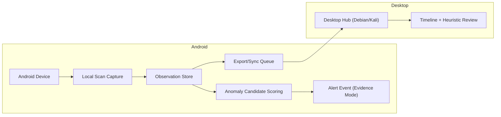

# Device ? Desktop Data Flow (Conceptual)

## Notes
- Observation Store is **local**, retaining timestamps, RSSI, SSID/BSSID, and coarse geo.
- Alert Event is **gated** by frequency rules to avoid false positives.
- Export/Sync Queue can be offline?safe; Desktop Hub reconciles when connected.
- Evidence Mode allows full identifiers when anomaly is detected.
