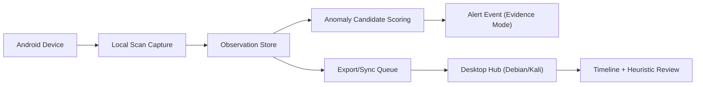

# WSCAN+ One-Page Summary (Non-Coding)

**Date**: 2026-03-19 (America/Los_Angeles)

## What's Verified Now
- **Wi-Fi scan with Wi-Fi OFF** works only if `wifi_scan_always_enabled=1`.
- **wpa_supplicant logcat** emits deauth/disconnect reason codes (usable via ADB).
- **Altitude** exists in fused/network provider but is **stale** without active updates.
- **Mock location** can inject altitude (FakeGPS Route), and OS marks `mock`.
- **Dev build** already has runtime permissions + foreground `WatchdogService`.
- **WiGLE exports** provide CSV/KML schema; `.m8b` format spec documented.

## What Requires App-Side Instrumentation
- BLE scan results
- Live location updates to avoid stale altitude
- Heuristic scoring output logs

## Evidence & Retention Policy
- Retain timestamps, RSSI history, SSID/BSSID/MAC, and coarse geo.
- Evidence mode **overrides redaction** on anomaly detection.
- Alerts should be gated by **repeat evidence** to reduce false positives.

## Reason-Code Rules (Verified Meanings Only)
- Reason codes are from 802.11 definitions (not attack labels).
- Use frequency/time windows to mark **anomalies**, not attacks.

## Device -> Desktop Data Flow

## Key Docs
- `docs/testing/shared/47_verification_status.md`
- `docs/research/codex/48_claude_briefing.md`
- `docs/research/codex/46_reason_code_frequency_ruleset.md`
- `docs/research/codex/42_minimal_retention_schema.md`
- `docs/testing/devices/motorola-g4-play-2024/findings/33_wigle_export_schema.md`
